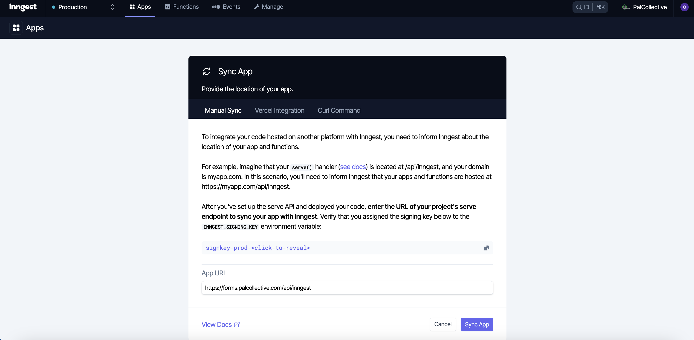
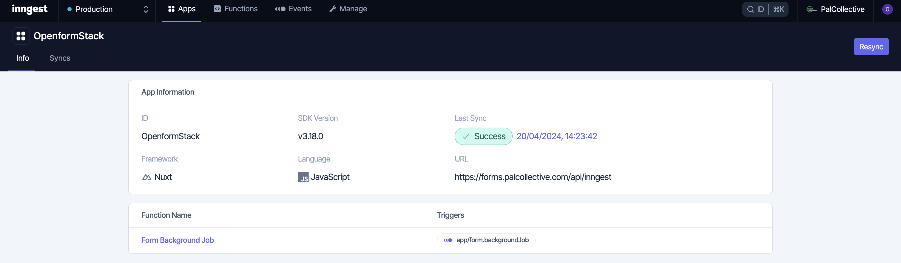
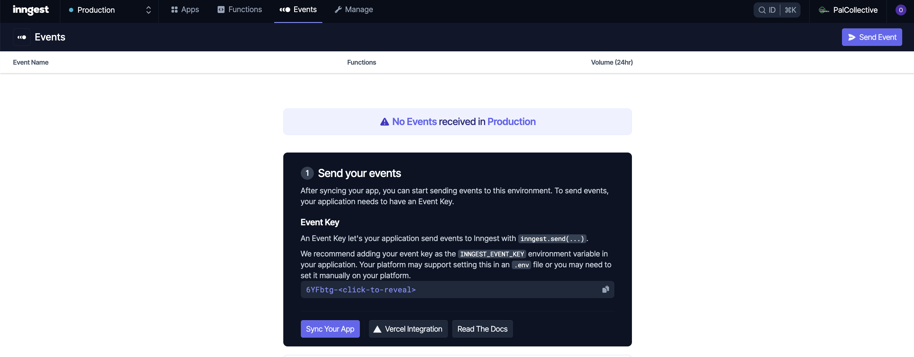

# Openformstack (PalCollective edition)

This is a forked, modified, and dockerised version of Openformstack for the purpose of using it in PalCollective's humanitarian operations.

The frontend forms themselves, can be hosted in other projects within the organisation

## Introduction

The purpose of this fork is to remove all pricing, billing, and analytics, while reducing dependencies on third-party services, and in the near future, steering away from Google OAuth into something like GitHub OAuth.

## Instructions

This project requires a lot of API keys and a significant about configuration.

Namely, you will need:
1. A _Google Workspace_ account with an app configured in testing for the emails you want to use this application with. (we hope to replace Google OAuth with GitHub OAuth soon).
1. [Inngest](https://www.inngest.com/) free account.
1. [Resend](https://www.resend.com/) free account.
1. [ByeSpam](https://byespam.co/) free account.

In addition, you will need access to the DNS provier to verify your domain, for the purpose of allowing the _Resend API_ to send emails from an email on that domain. This process can be a little icky, especially if you have _Gmail_ already configured on that domain.

### Running in development

> [!WARNING]
> If you have the utility `direnv` installed and configured in your terminal, then ensure to run the command `direnv disallow .` before proceeding.

> [!IMPORTANT]
> To ensure that you are using the right docker context (local, rather than remote), use `docker context list` and `docker context show`. If there is only one context or if the local context is chosen as the current one, then you may proceed.

> [!CAUTION]
> if you tried running the application in production (locally) prior to running it in development, then please remember to shut down the application running in production first, which can be done using the following command:
> ```bash
> docker compose -f docker-compose.prod.yml down
> ```
> To ensure that the production application is shut down before proceeding, use the following command:
> ```bash
> docker ps -f="name=forms"
> ```
> ... the resulting list should be empty.

Use the `docker-compose-dev.sh` script to run the application in development, and the `docker-compose-dev-logs.sh` script to display the logs in realtime, on your local machine.

Note that you may need to update Docker Desktop, to be able to run the `docker-compose-dev.sh` script, as it uses the `docker watch` command, which requires docker compose v2.22.0 or higher.

### Running in production (locally)

> [!WARNING]
> This flow is a work in progress, the inngest app sync step requires extra work.
> The command needed to sync the app is:
> ```bash
> curl -X PUT http://localhost/api/inngest
> ```
> ... which currently returns an error message:
> ```json
> {"message":"Cannot deploy localhost functions to production.  Please use a forwarder like tunnelto or ngrok.","modified":false}
> ```

> [!WARNING]
> If you have the utility `direnv` installed and configured in your terminal, then ensure to run the command `direnv disallow .` before proceeding.

> [!IMPORTANT]
> To ensure that you are using the right docker context (local, rather than remote), use `docker context list` and `docker context show`. If there is only one context or if the local context is chosen as the current one, then you may proceed.

> [!CAUTION]
> if you tried running the application in development prior to running it in production (locally), then please remember to shut down the application running in development first, which can be done the following command:
> ```bash
> docker compose -f docker-compose.dev.yml down
> ```
> To ensure that the production application is shut down before proceeding, use the following command:
> ```bash
> docker ps -f="name=openformstack"
> ```
> ... the resulting list should be empty.

To run the application in production, but locally on your computer, then please use the following command:
```bash
docker compose -f docker-compose.prod.yml up --build
```

This command will build the docker images needed, and launch them in the right order. As the containers are launched/orchestrated, you will be able to see the logs in realtime.

To access the application, please type http://localhost in the address bar of your browser (note that if port 80 is used by another application, then the command above will fail).

### Running in production (remotely)

#### Obtain access to the remote

> [!NOTE]
> This step only needs to be performed once.

In order to have access to the remote using a public/private key pair, you need to _append_ the text of your public key onto `~/.ssh/authorized_keys` on the remote.

To do that, I used the root shell functionality from the cloud provider's web dashboard, and added the text of my public certificate using the `nano` text editor (using a simple copy-and-paste operation).

After this, I was able to SSH into the remote using the command:
```bash
ssh root@XXX.XXX.XXX.XXX
```
... where `XXX.XXX.XXX.XXX` is the public IP address of the remote.

#### Edit local SSH config

> [!NOTE]
> This step only needs to be performed once.

After adding your public certificate to the remote, edit your SSH config locally `~/.ssh/config` to include the following:
```
Host ypc XXX.XXX.XXX.XXX
    User root
    HostName XXX.XXX.XXX.XXX
    PreferredAuthentications publickey
```
... where, again, `XXX.XXX.XXX.XXX` is the public IP address of the remote.

After this, I was able to SSH into the remote using the simpler command:
```bash
ssh ypc
```

#### Create remote docker context

> [!NOTE]
> This step only needs to be performed once.

Docker context is a feature that allows you to run docker commands against a remote machine, as if you are running the commands on that remote machine (e.g. using SSH).

To permit this, you must create the docker context first (using `docker context create`), which can be done using the SSH configuration above:
```
docker context create ypc --docker "host=ssh://root@ypc"
```

#### Install direnv

> [!NOTE]
> This step only needs to be performed once.

[Install](https://direnv.net/docs/installation.html) the `direnv` utility and [configure](https://direnv.net/docs/hook.html) it into the shell you are using, using the instructions online

#### Activate the remote context

> [!NOTE]
> This step only needs to be performed and unperformed each time you switch from working locally to working remotely, and vice versa.

Navigate to the root folder of the repo, and allow access to the local `.envrc` file, which contains the remote docker context, using the command:
```bash
direnv allow .
```

From this point on, if you run `docker ps`, you must be able to see the docker containers running on the remote (i.e. the `ypc` server), rather than locally.

The same thing can be confirmed by using the `docker context list` and `docker context show` commands. If the current docker context is `ypc`, then you may proceed.

#### Setup files and folders

Before running the application on the remote, there are folders and files that need to exist there for the application to run correctly.

These folders and files can be created using shell (i.e. SSH) access:
1. Create a DB data folder (if it does not already exist), in the location `/opt/openstackforms/db-data` on the remote.
1. Create a file and fill it with a random password (not using special characters) in `/opt/openstackforms/secrets/pg_pass` on the remote (this file will be used for the postgres database password in production).
1. Create a properly filled `.env` secrets file (following the instructions in `.env.example`) and store it at `/opt/openstackforms/secrets/.env` on the remote. 

... with these steps successfully performed, you are ready to move to launching the application.

#### Launch the application

To run the application using docker compose, the following command can be used locally, from the root of the repository folder, after switching to the remote docker context:
```bash
docker compose -f docker-compose.prod.ypc.yml up --build --detach
```

To view the logs in realtime, use the command:
```bash
docker compose -f docker-compose.prod.ypc.yml logs --follow
```

#### Sync the inngest provider

By now, the application should work and must be accessible at https://forms.palcollective.com, but submitting the forms will return an HTTP code 500, and error messages will show in the logs.

This is due to the inngest app not being synced with the third-party service provider. To do this, login to your inngest dashboard and sync the application by adding `/api/inngest` to the base URL of the application as shown below, then click **Sync App**:


If all goes well, then the app should be synced successfully as shown below:


Finally, you must use the SSH access you have to update the `NUXT_INNGEST_SIGNING_KEY` and `NUXT_INNGEST_EVENT_KEY` secret values on the remote, which are contained within the `/opt/openformstack/secrets/.env` file on the remote.

The values for these keys can be easily found in the inngest dashboard. An example screenshot is shown below:


Then, rebuild/restart the application using the following commands, which must be executed from the root of the repository while using the remote docker context (i.e. `ypc`):
```bash
docker compose -f docker-compose.prod.ypc.yml down
docker compose -f docker-compose.prod.ypc.yml up --build --detach
```

Now, the application must work fully and without any problems.

# Original documentation

This repository contains a Nuxt 3 application for creating and managing headless forms. The application uses Prisma for ORM and provides a user interface for creating and managing workspaces and forms.

## Requirements
1. Node.js( ***version 18 or higher*** )

2. Yarn package installer

3. Docker

4. Docker compose.exe if the .exe file is not included in the docker setup installation then download it from the docker page

## Setup Process

1. Clone the repository

```bash
git clone https://github.com/your-repo/OpenformStack.git
cd OpenformStack
```
2. Install Dependencies
   
```bash
yarn install
```
3. Create a `.env` file in the root directory of the project by copying the `.env.example` file:

for linux/macOS users
```bash
cp .env.example .env
```
for windows users
```bash
copy .env.example .env
```

4. Create a .env.developer.local file in the root folder of the project
   
For macOS/Linux 
```bash
touch .env.development.local
```
For windows
```bash
type nul > .env.development.local
```
5. Copy the code into the .env.development.local file

```bash
GOOGLE_CLIENT_ID=508816847621-jd5rqskggrh7veqi4pqjtj3nfleqt405.apps.googleusercontent.com
GOOGLE_CLIENT_SECRET={ask admin for secret}
API_ROUTE_SECRET=(ask admin for secret}
AUTH_ORIGIN="http://localhost:3000"
BASE_URL="http://localhost:3000"
```

6. Start the PostgreSQL database using Docker Compose:

```bash
docker-compose up -d
```
7. Run the prisma database migrations and generate the Prisma client:

```bash
yarn prisma:migrate:dev
yarn prisma:migrate:generate
```
8. Start the development server:

```bash
yarn dev
```

If you are facing an error in signing up then delete yarn lock file and node_modules file and re-install the yarn packages.

Yarn commands are often used in the context of database migrations. Here's what each of the commands you mentioned typically does:

a) yarn prisma:migrate:dev:

This command is usually used to apply pending database migrations in a development environment.
It runs the migrations that have been generated but not yet applied to the database.


b) yarn prisma:migrate:generate:
This command generates new Prisma migration files based on changes in your Prisma schema.
It compares the current state of your database with the Prisma schema and generates migration files that represent the changes needed to bring the database schema in sync with the Prisma schema.
